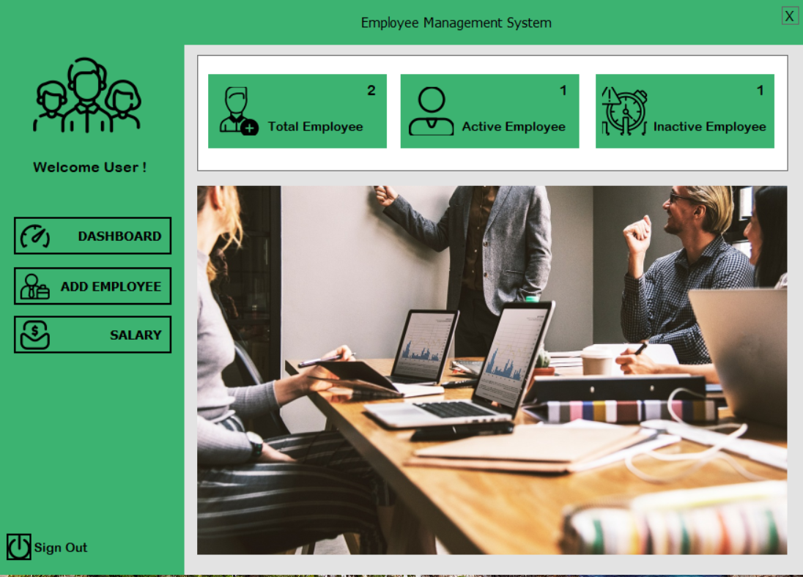

# Employee-Management-System
An Employee Management System built using C# and the .NET Framework with SQL Server as the database. This system provides features to manage employee data, including adding, updating, and deleting employee records.

---

---
## Features
- Add new employees with details such as ID, name, gender, contact number, position, and status.
- Update existing employee details.
- Delete employee records while maintaining a record of the deletion date.
- Display all employee records in a DataGridView.
- Upload and display employee profile pictures.
- Maintain a robust and user-friendly interface.

---

## Technologies Used
- **Frontend**: Windows Forms (.NET Framework)
- **Backend**: C# (Object-Oriented Programming)
- **Database**: SQL Server (Local `.mdf` file for data storage)
- **IDE**: Microsoft Visual Studio

---
## Prerequisites

- **Software**: 
  - Microsoft Visual Studio
  - SQL Server or SQL Server Express
- **Packages**:
  - .NET Framework (compatible version)
- **Knowledge**:
  - Basic understanding
